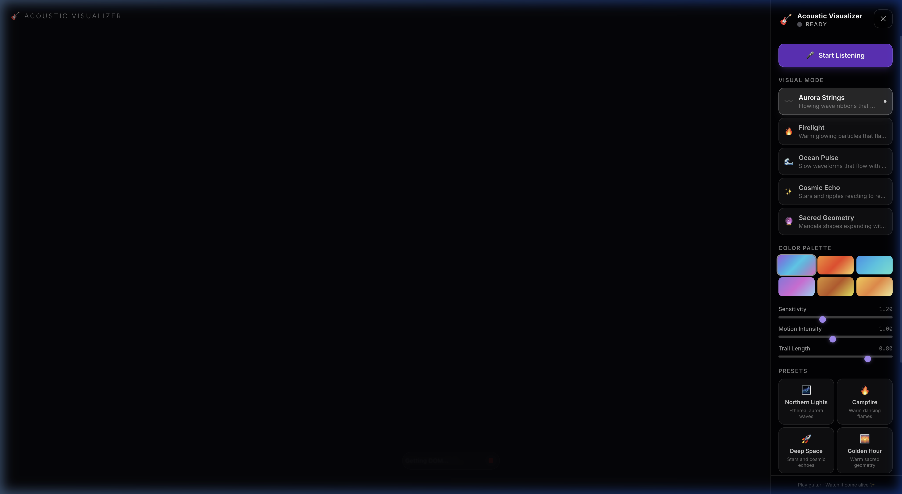

# 🎸 Acoustic Visualizer

A cinematic, real-time music visualizer that reacts to your acoustic guitar through your computer microphone. Play a chord and watch the screen come alive.

    

---



---

## ✨ Features

### 5 Visual Modes
| Mode | Description |
|---|---|
| 〰️ **Aurora Strings** | Flowing sine-wave ribbons layered and phase-shifted, pulsing with chord energy |
| 🔥 **Firelight** | Warm particle system — particles spawn at the base and flare upward on hard strums |
| 🌊 **Ocean Pulse** | Layered waveforms with ripple rings and glowing reflections for soft fingerpicking |
| ✨ **Cosmic Echo** | Star field with expanding circular rings that spawn on every transient |
| 🔮 **Sacred Geometry** | Rotating mandala built from recursive polygons — each strum triggers a rotation impulse |

### Real-Time Audio Analysis
- **Volume / Amplitude** — overall loudness from RMS waveform
- **Bass Energy** (20–300 Hz) — guitar body resonance and low notes
- **Mid Energy** (300–3,000 Hz) — string warmth and chord body
- **High Energy** (3,000–20,000 Hz) — pick attack and string sparkle
- **Strum Detection** — onset transient detection for reactive burst effects
- **Exponential smoothing** — fluid visuals without jitter

### Controls Panel
- 🎤 Start / Stop microphone with animated status indicator
- 🎨 6 color palettes: Aurora · Fire · Ocean · Cosmic · Earth · Golden Hour
- 🎚️ Sensitivity, Motion Intensity, and Trail Length sliders
- 🌌 4 preset themes: Northern Lights · Campfire · Deep Space · Golden Hour
- 📷 Screenshot → saves PNG
- ⏺ Record → saves WebM video
- 🎵 Audio file upload (MP3, WAV, OGG)
- ⛶ Fullscreen mode

---

## 🚀 Getting Started

### Prerequisites
- Node.js 18+
- A computer with a microphone
- An acoustic guitar (or any instrument)

### Install & Run

```bash
# Clone or navigate to the project
cd /path/to/MusicVisualizer

# Install dependencies
npm install

# Start the dev server
npm run dev
```

Open [http://localhost:5173](http://localhost:5173) in your browser.

### Build for Production

```bash
npm run build
npm run preview
```

---

## 🎮 How to Use

1. Open the app in your browser
2. Click **"Start Listening"** in the right panel
3. Grant microphone permission when the browser prompts
4. Play your acoustic guitar — watch the visuals react live
5. Switch modes, adjust sliders, and try the preset themes

> **Tip:** Turn up **Sensitivity** if your mic is far from your guitar, or if you're playing softly. The **Trail Length** slider controls how long motion traces persist on screen.

---

## 🏗️ Project Structure

```
src/
├── types/
│   └── audio.ts              # AudioData, VisualizerSettings types
├── audio/
│   ├── audioEngine.ts        # AudioContext + AnalyserNode wrapper
│   └── audioUtils.ts         # Band energy, volume, strum detection, smoothing
├── hooks/
│   └── useAudioAnalyzer.ts   # React hook managing audio lifecycle + RAF polling
├── visualizers/
│   ├── AuroraStrings.ts
│   ├── Firelight.ts
│   ├── OceanPulse.ts
│   ├── CosmicEcho.ts
│   ├── SacredGeometry.ts
│   └── index.ts              # Factory + mode metadata registry
├── components/
│   ├── VisualizerCanvas.tsx  # Full-screen canvas + RAF animation loop
│   ├── ControlPanel.tsx      # Glassmorphism side panel
│   ├── MicStatus.tsx         # Animated status indicator
│   ├── ModeSelector.tsx      # Visual mode card picker
│   ├── PresetThemes.tsx      # One-click preset configurations
│   └── AudioFileUploader.tsx # Drag-and-drop audio file input
├── utils/
│   ├── colorPalettes.ts      # 6 curated color palettes + HSL helpers
│   ├── canvasUtils.ts        # Trail clearing, glow drawing, geometry helpers
│   └── mediaRecorder.ts      # Screenshot PNG + canvas stream WebM recording
├── App.tsx                   # Root component — assembles everything
├── main.tsx                  # React entry point
└── index.css                 # Tailwind + custom slider/scrollbar styling
```

---

## 🧠 Audio Analysis

The app uses the browser's **Web Audio API** with no external audio libraries.

```
Microphone → MediaStreamSource → AnalyserNode → getByteFrequencyData() / getByteTimeDomainData()
```

| Measurement | Method |
|---|---|
| Volume | RMS of time-domain waveform samples |
| Band Energy | Sum of FFT bins in frequency range, normalized 0–1 |
| Strum | Delta volume threshold — sudden energy spike |
| Smoothing | Per-value exponential smoothing at different rates |

The `AnalyserNode` uses:
- **FFT size:** 2048 (1024 frequency bins, ~43 Hz resolution at 44.1 kHz)
- **Built-in smoothing:** 0.8 time constant
- **Additional smoothing:** exponential per band in `audioEngine.ts`

---

## 🎨 Adding a New Visual Mode

1. Create `src/visualizers/YourMode.ts` implementing:
   ```ts
   export class YourMode {
     render(ctx: CanvasRenderingContext2D, audioData: AudioData, settings: VisualizerSettings, dt: number): void { ... }
     reset(): void { ... }
   }
   ```
2. Register it in `src/visualizers/index.ts`:
   ```ts
   const RENDERERS = {
     ...existing,
     yourmode: () => new YourMode(),
   };
   ```
3. Add the mode label and icon to `MODE_INFO` in `index.ts`
4. Add `'yourmode'` to the `VisualizerMode` union in `src/types/audio.ts`

---

## 🛠️ Tech Stack

| Tool | Purpose |
|---|---|
| [React 18](https://react.dev) | UI components and state |
| [TypeScript 5.5](https://www.typescriptlang.org) | Type safety throughout |
| [Vite 5](https://vitejs.dev) | Dev server and build tool |
| [Tailwind CSS 3](https://tailwindcss.com) | Utility-first styling |
| [Web Audio API](https://developer.mozilla.org/en-US/docs/Web/API/Web_Audio_API) | Audio capture and frequency analysis |
| [Canvas 2D API](https://developer.mozilla.org/en-US/docs/Web/API/Canvas_API) | All visual rendering |
| [MediaRecorder API](https://developer.mozilla.org/en-US/docs/Web/API/MediaRecorder) | WebM video recording |

No backend. Everything runs locally in the browser.

---

## 🌐 Browser Compatibility

| Browser | Support |
|---|---|
| Chrome / Edge | ✅ Full support |
| Firefox | ✅ Full support |
| Safari | ⚠️ Microphone requires HTTPS or localhost |

> **Note:** `getUserMedia` requires either `localhost` or an HTTPS origin. The Vite dev server on `localhost:5173` works without HTTPS.

---

## 📄 License

MIT — do whatever you like with it.
